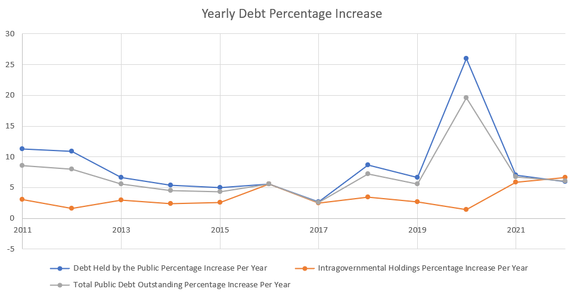
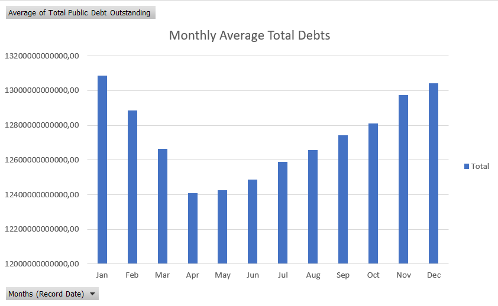
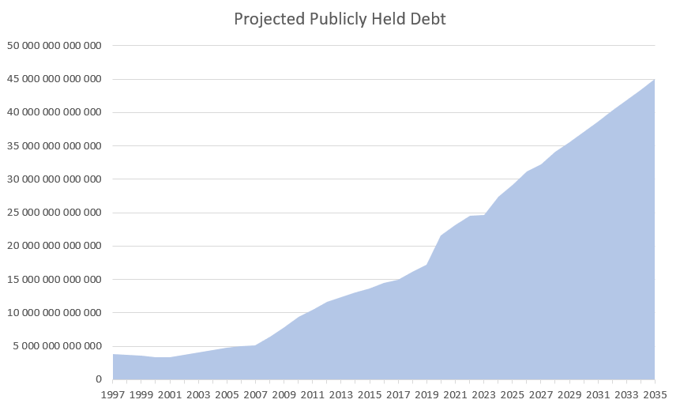
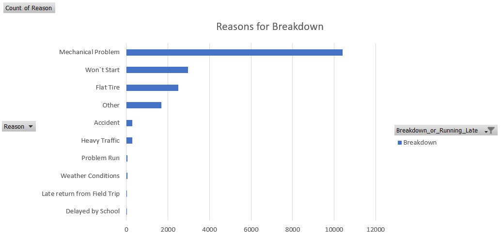
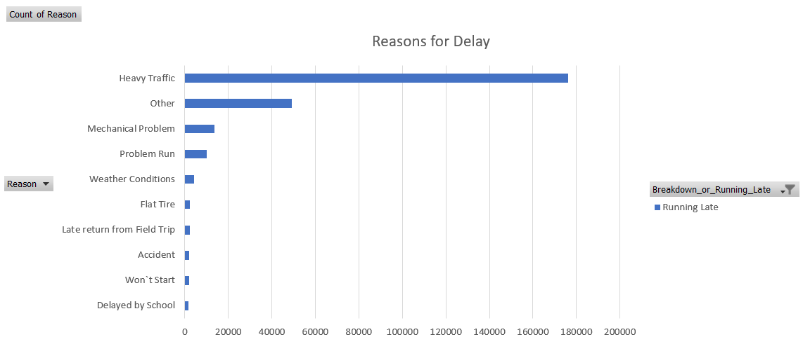
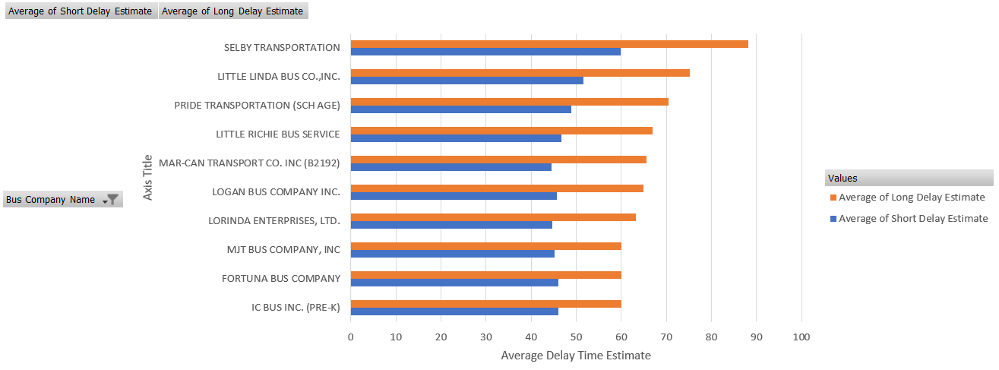
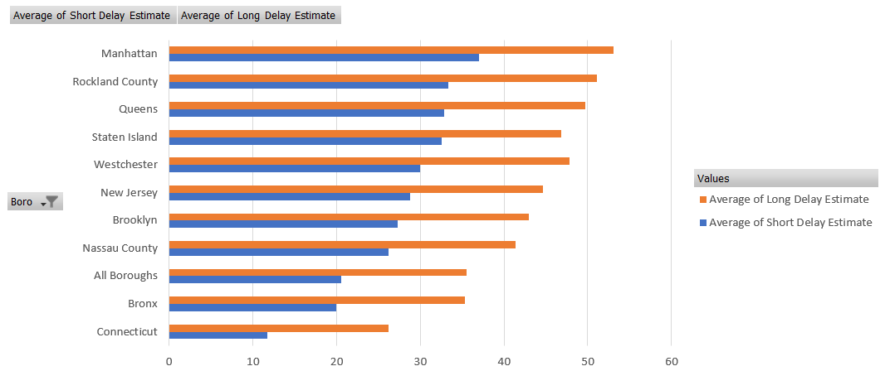
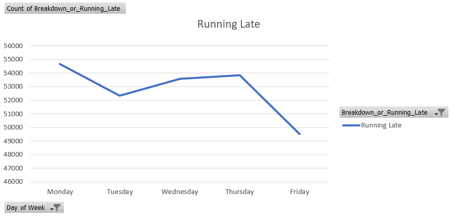

# data-analysis-with-excel
In this repo, I practiced data analytics skills like data cleaning teachniques, data transformation, data standardization, pivot tables, data visualization, inbuilt formulas and functions in Microsoft Excel and some other technical skills.

## Datasets
Two datasets were used to practice the technical skills. The first dataset is the debt records of loan applications of US Citizens from 1993 to 2023. It contains over 7000 rows and only four coulmns which are `Record Date`, `Debt Held by the Public` (this is the portion of the US public debt that is held by individuals, corporations, foreign governments, and other entities outside of the US government), `Intragovernmental Holdings` (this is the portion of the US public debt that is held by other US government agencies), `Total Public Debt Outstanding` (this is the sum of the debt held by the public and intragovernmental holdings). This data was first cleaned by transposing the rows into columns and then normalizing the data entries from scientific format to number format.

### Aims/Goals
The questions we sort to answer using data analytics techniques like charts/graphs and narratives are:
1. What was the Yearly Debt Percentage Increase for each year compared to the previous year?
2. Which months historically have seen the highest/lowest increases in Total debt?
3. What is the projected growth of the publicly held debt in the next few years?

### Business Insights from Data
1. Using the data, it was realized that the debt was stabilized at approximately 9% between 2011 and 2012. It witnessed a drop to approximately 6% between 2012 and 2016. Fluctuated between 3% and 7% within three years. There was a huge spike due to the onset of the global pandemic/lockdown in 2020 and 2021.

2. The data informs us that the highest Debt Increases historically occur during the months of January, Febuary, November and December. Lowest Debt Increase months historically occur during the months of March , April, May, June and July. This is due to holidays in the US such as Thanksgiving, Christmas and New Year that people spend money buying gifts for loved ones, friends and family. During the low months, there are no major celebratory holidays.

3. Using the forecast function in Microsoft Excel, the projected forecast is that between 2024 to 2035, the publicly held debt will grow to 45 Trillion Dollars.We can then conclude that publicly held debt will continue to steadily increase over the next 11 years.

## Datasets
The second dataset is related to significant number of bus breakdowns and delaysbeing experienced in New York city. This has been causing inconvenience to commuters and straining the city's public transportation resources. The dataset is quite large at over 280000 rows and over 20 columns. We only made use of the columns `Reason`, `Occured_On` (we extracted the `Day_of_Week` as a new column), `Bus_Company_Name` (standardized it by using a single name for companies saved with different names in a new column) and `How_long_Delayed` (we created two new columns by splitting the range into `Short Delay Estimate` and `Long Delay Estimate`).

### Aims/Goals
Our task is to analyze the provided data to identify patterns and factors that contribute to these breakdowns and delays. We will achieve these my answering these questions.

1. What are the most common reasons for delays and breakdowns?
2. How do delay times vary by bus company and borough?
3. Is there a correlation between specific days of the week and the frequency of breakdowns or delays?

### Business Insights from Data
1. It was discovered that the majority of breakdowns are due to mechanical problems or won't start. These are both mechanical problems due to lack of proper maintenance. 

A probable solution would be to engage precautionary maintenance to prevent mechanical problems. The city can also schedule to have buses serviced monthly or quartely to reduce mechanical issues.

For running late, it was discovered that the main cause of delays is traffic. This could be resolved by having buses pick up students at non-peak traffic times.

It was also noted from the graph that there are almost 14000 delays due to mechanical problems. Which could be resolved from the previous recommendation to service vehicles more frequently.

2. Due to a large number of bus companies having the contract with the city, we could only focus on the top ten companies with the longest/highest average delay time estimates. The resulting chart displays this information visually.

Delays could be due to several reasons like mechanical issues which could be fixed through mechanical maintenance. Or the bus company is not efficient and needs to be warned and later fired if their service doesn't improve.

In the above chart, we try to investigate the cities that have the longest average delay estimates to see if this agrees with what we know about traffic congestion in densely populated axis or axis having a lot of business districts.

3. From the two charts we have for this question, we observe a similar trend for either delays due to breakdowns or running late. There is a spike in delays on Mondays and a sharp decrease in delays on Fridays.

There are more breakdowns on Monday and the frequency of breakdown decreases as the week passes by.

Since the majority of delays are caused by traffic, we can assume the decrease in delays on Fridays are caused by less people going to work or driving on that day. The city should also consider scheduling maintenance over weekends to mitigate the effect of breakdowns.
